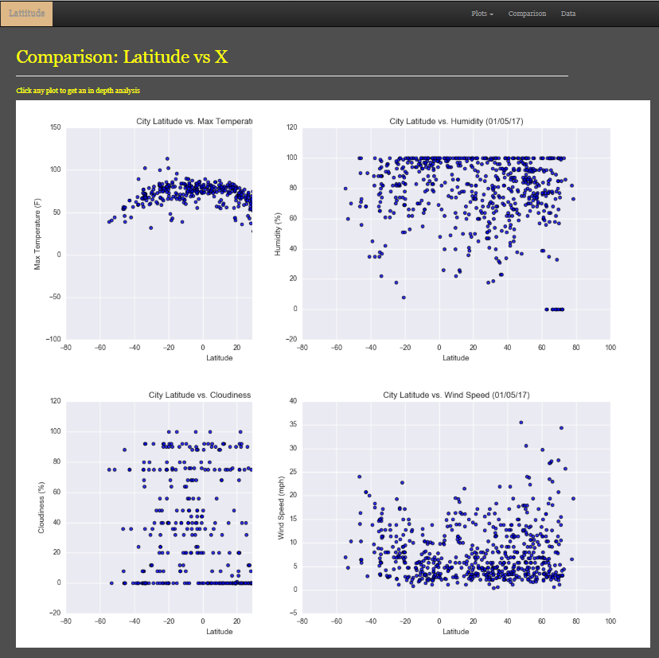
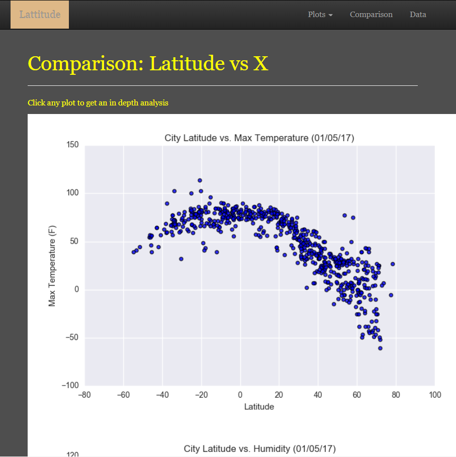
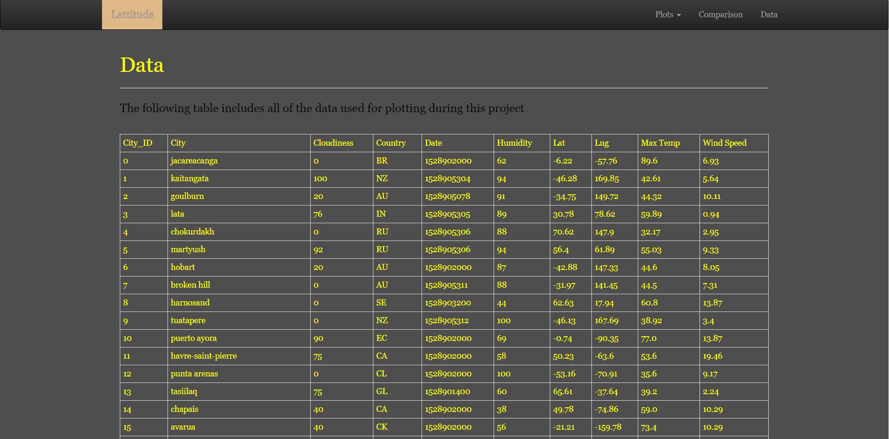

# HTML-CSS

## Latitude - Latitude Analysis Dashboard with Attitude

For this project, a visualization dashboard website was created using a sample CSV. Specifically, we'll be plotting [weather data](Resources/cities.csv).

In building this dashboard, we'll create individual pages for each plot and a means by which we can navigate between them. These pages will contain the visualizations and their corresponding explanations. We'll also have a landing page, a page where we can see a comparison of all of the plots, and another page where we can view the data used to build them.

### Website Requirements

For reference, see the ["Screenshots" section](#screenshots) below.

The website must consist of 7 pages total, including:

* A [landing page](#landing-page) containing:
  * An explanation of the project.
  * Links to each visualizations page.
* Four [visualization pages](#visualization-pages), each with:
  * A descriptive title and heading tag.
  * The plot/visualization itself for the selected comparison.
  * A paragraph describing the plot and its significance.
* A ["Comparisons" page](#comparisons-page) that:
  * Contains all of the visualizations on the same page so we can easily visually compare them.
  * Uses a bootstrap grid for the visualizations.
    * The grid must be two visualizations across on screens medium and larger, and 1 across on extra-small and small screens.
* A ["Data" page](#data-page) that:
  * Displays a responsive table containing the data used in the visualizations.
    * The table must be a bootstrap table component.
    * The data must come from exporting the `.csv` file as HTML, or converting it to HTML. You may use a csv-to-html table conversion tool, e.g. [ConvertCSV](http://www.convertcsv.com/csv-to-html.htm).

### Screenshots

#### Comparisons page

Large screen:

Small screen:

#### Data page

Large screen:

Small screen:

